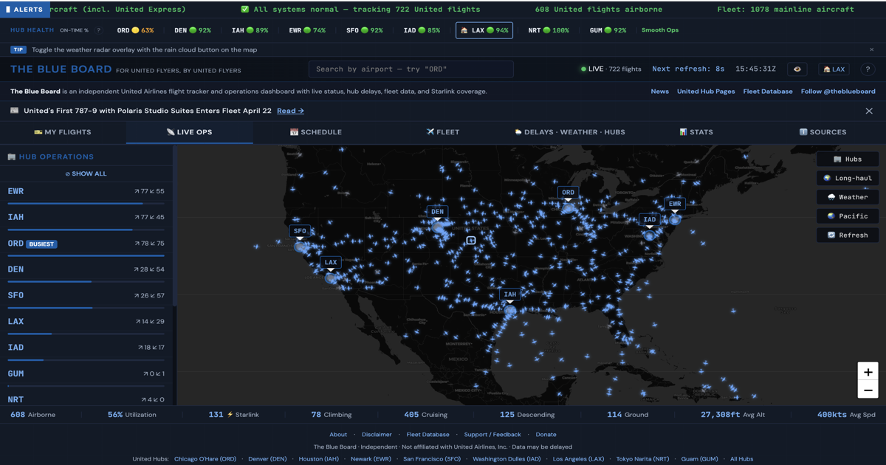

# ✈️ The Blue Board

**An unofficial, real-time operations dashboard for United Airlines — built by flyers, for flyers.**

**[→ Live Dashboard](https://theblueboard.co)** · **[📋 Changelog](CHANGELOG.md)** · **[🎨 Design System](DESIGN.md)** · **[☕ Support the Project](https://buymeacoffee.com/notjbg)** · **[💡 Suggest a Feature](https://github.com/jonahberg/the-blue-board/issues)** · **[𝕏 Follow @theblueboard](https://x.com/theblueboard)**



<!-- This is a static Markdown file and cannot import the data modules.
     Hub-count language and the fleet database count below must be kept in sync
     BY HAND with src/data/facts.js; Starlink figures live in
     src/data/starlink-facts.js (refreshed into src/data/starlink-live.json at
     build time), so quote them loosely here and let the site stamp the exact
     number. -->

---

## What Is This?

The Blue Board is a fan-built operations dashboard that lets you see United Airlines like an ops center would — live flight positions, hub schedules, fleet data, delays, weather, and stats, all in one dark, data-dense interface.

**Not affiliated with United Airlines, Inc.** This is an independent project by an aviation enthusiast.

---

## Features

### 📡 [Live Ops](https://theblueboard.co#live)
Real-time map tracking 600+ United flights, updated every 30 seconds. Filter by hub, toggle longhaul routes, overlay NEXRAD weather radar. Hub status sidebar shows departure/arrival counts and identifies the busiest hub. Search any flight by number, tail, or route. Great circle route lines show flight paths with city names.

### ⚠️ IROPS Monitor + AI Delay Prediction
Server-side disruption scoring across all 8 United hubs plus the Tokyo-Narita gateway — cancellations, delays (30m/60m), diversions, and FAA ground stops. **AI-powered delay risk engine** uses 8 signals (actual delay, FAA programs, weather, hub OTP, time-of-day, inbound aircraft, hub risk profile) to score delay risk 0–100. Click any risk badge for a **natural language AI explanation** powered by Claude. Preloaded automatically on page load with 5-minute server-side caching.

### 📅 [Schedule](https://theblueboard.co#schedule)
Departure and arrival boards for all 9 UA hubs (ORD, DEN, IAH, EWR, SFO, IAD, LAX, NRT, GUM). Filter by status or aircraft type. Equipment swap detection flags when a plane type changes. On-time performance stats. All times in airport-local timezone.

### ✈️ [Fleet](https://theblueboard.co#fleet)
Complete database of 1,078+ mainline aircraft — searchable and sortable by type, registration, seat config, WiFi, and IFE. Live fleet status correlates airborne flights with the database, and a delivery timeline charts the fleet by family. **19 dedicated fleet type pages** ([737 MAX 9](https://theblueboard.co/fleet/737-max-9), [A321neo](https://theblueboard.co/fleet/a321neo), [787-9](https://theblueboard.co/fleet/787-9-dreamliner), etc.) with full aircraft registries, structured data, and cross-type navigation.

### 🛰️ [Starlink](https://theblueboard.co#starlink)
Its own tab since the rebuild. The full roster of Starlink-equipped aircraft (500+ and climbing toward United's ~1,000 target) with sortable columns and filters by fleet, type, and operator, a retrofit-pace chart with a completion projection, and a mismatch report that flags aircraft the upstream tracker and the fleet database disagree about.

### 🎫 [My Flights](https://theblueboard.co#myflight)
Save the flights you actually care about. Add one by number, see its live position, route, aircraft and times, and pin it to the watch list for browser push notifications on status changes — including background alerts that fire with the tab closed ([setup](docs/setup-push-alerts.md)). Stored on your device; nothing is sent to a server you didn't ask for.

### 🌦 [Delays · Weather · Hubs](https://theblueboard.co#weather)
FAA NAS delay and ground stop alerts, METAR observations with plain-English explainers, NEXRAD radar overlay, and hub health indicators. Each hub gets a unified card with conditions, visibility, wind, ceiling, and current delay status. **Ops Impact Assessment** goes beyond standard flight categories to flag real operational risks — snow, gusts, freezing precipitation, thunderstorms — even when conditions are technically VFR. Radar map renders instantly; weather data loads in parallel via batched API calls.

### 📊 [Stats](https://theblueboard.co#stats)
Live fleet utilization by aircraft type (airborne vs. total), flight phase distribution (climb/cruise/descent donut chart), hub-to-hub traffic flow matrix, top active routes, fleet delivery timeline with stacked histogram colored by aircraft family, and Starlink coverage metrics. All live data updates every 30 seconds.

### 🔍 Flight Search
Look up any UA flight number from the header search bar. Returns live position, route, aircraft details, and scheduled/actual times via the official Flightradar24 API.

### 🏢 [Hub Pages](https://theblueboard.co/hubs/ord)
Dedicated SEO-rich pages for the 9 airports The Blue Board tracks — United's 8 hubs plus the Tokyo-Narita gateway ([ORD](https://theblueboard.co/hubs/ord) · [DEN](https://theblueboard.co/hubs/den) · [IAH](https://theblueboard.co/hubs/iah) · [EWR](https://theblueboard.co/hubs/ewr) · [SFO](https://theblueboard.co/hubs/sfo) · [IAD](https://theblueboard.co/hubs/iad) · [LAX](https://theblueboard.co/hubs/lax) · [NRT](https://theblueboard.co/hubs/nrt) · [GUM](https://theblueboard.co/hubs/gum)). Each page includes live flight counts, hub overview with terminal/concourse details, United Club and Polaris lounge locations, delay pattern analysis by season, Starlink WiFi info, construction alerts with links to official project pages, structured FAQ, and FAQPage + Airport schema markup for search engines. Jump navigation and scroll hints guide visitors through the content.

### 📰 [News](https://theblueboard.co/news)
Curated United Airlines news hub with individual article pages, source links, and cross-links to related hub and fleet pages via tags. Google News sitemap and dynamic RSS feed for indexing. "Latest News" banner on the dashboard links to the newest article (dismissible, and it stays dismissed). Optional email digest via Resend Broadcasts notifies waitlist subscribers of new articles.

### 📍 [Trackers](https://theblueboard.co/trackers)
Living, data-driven pages that follow aviation's long-running stories — each with a dependency-free SVG US map, headline stats, a searchable/sortable table, and a changelog. [Modern Skies Tracker](https://theblueboard.co/trackers/atc) covers the FAA's paper-to-digital flight strip rollout at all 89 program airports; [United Hub Tracker](https://theblueboard.co/trackers/united-hubs) covers every United club, terminal, and gate project across the 8 hubs with honest open/under-construction/announced/rumored labels. High-interest United hubs have focused, source-backed detail pages for construction and tower modernization, and both datasets are downloadable as CSV or JSON. Every entry cites a source; data lives in versioned files under `src/data/trackers/` with import-time validation (see `MAINTENANCE.md`).

### More
- **AI delay risk scoring** — 8-signal algorithm considers weather, FAA programs, hub OTP, inbound aircraft, time-of-day cascade risk, and hub-specific profiles
- **AI delay explanations** — Click any risk badge for a natural language briefing powered by Claude AI
- **Inbound aircraft tracking** — "Where's My Plane?" shows your aircraft's current position operating its previous flight
- **Deep-link hashes** — Share direct links to any tab (`#live`, `#myflight`, `#schedule`, `#fleet`, `#starlink`, `#weather`, `#stats`, `#sources`), or link straight to a flight with `/?flight=UA1234`
- **Flight watch** — Pin a flight and get browser push notifications on status changes, including background alerts that fire even when the tab is closed once the owner enables Web Push ([setup](docs/setup-push-alerts.md))
- **Hub health bar** — At-a-glance on-time performance across all 8 United hubs plus the Tokyo-Narita gateway, with cancellation rate detection (shows `100% CX` when a hub is shut down)
- **Equipment swap alerts** — Badges when scheduled aircraft type changes
- **📱 Mobile-first design** — Map-maximized layout with bottom tab bar navigation, collapsible filters
- **PWA support** — Installable as a home screen app on iOS/Android with offline caching
- **Sources tab** — Every upstream feed the dashboard uses, with its freshness and its licence credit, in one place
- **Stats charts** — Utilization bars, a flight-phase donut, the hub-to-hub matrix and top routes, each colour-coded *and* labelled
- **Jargon tooltips** — Hover any aviation term (IROPS, GDP, METAR, MVFR) for a plain-English definition
- **Global search (⌘K)** — Jump to a flight, hub, fleet type or page from anywhere

---

## Architecture

```
┌──────────────────────────────────────────────────────┐
│                      Browser                          │
│                                                       │
│  Astro static shell (src/pages/*.astro)               │
│  ├── /  → one React island, client:only="react"       │
│  │        src/app/Dashboard.tsx — 8 lazy-loaded tabs  │
│  │        Leaflet map (bundled) + CARTO dark tiles    │
│  │        NEXRAD radar tile overlay                   │
│  ├── /hubs /fleet /news /trackers /newark /privacy    │
│  │        prerendered HTML on BaseLayout              │
│  ├── shadcn/ui primitives, Tailwind v4 tokens         │
│  ├── Logic + colour encodings in src/lib (unit-tested)│
│  └── All upstream calls go through /api proxies       │
└──────────────┬───────────────────────────────────────┘
               │
    ┌──────────▼──────────────────────────────┐
    │        Vercel Serverless Functions       │
    │                                          │
    │  /api/schedule        — hub boards (FR24 │
    │                         + AeroDataBox)   │
    │  /api/irops           — IROPS metrics    │
    │  /api/fr24-feed       — live flight feed │
    │  /api/fr24-flight     — flight lookup    │
    │  /api/flight-times    — per-flight times │
    │  /api/aircraft-history— tail history     │
    │  /api/check-flight    — watch-list poll  │
    │  /api/predict-flight  — delay prediction │
    │  /api/delay-explain   — AI briefings     │
    │  /api/metar           — AWC weather      │
    │  /api/faa  /api/nas   — FAA NAS status   │
    │  /api/fleet /api/fleet-summary           │
    │  /api/starlink-data                      │
    │  /api/starlink-mismatches                │
    │  /api/push-subscribe  — Web Push signup  │
    │  /api/waitlist        — waitlist signup  │
    │  /api/news-notify     — email digest     │
    │  /api/support-stats   — donation meter   │
    │  /api/fr24-usage      — credit monitor   │
    │                                          │
    │  Cron jobs (vercel.json):                │
    │  /api/cron/warm-schedules  — hourly      │
    │  /api/cron/sync-starlink   — every 4hrs  │
    │  /api/cron/refresh-metar   — every 5min  │
    │  /api/cron/watch-alerts    — every 5min  │
    └──────────┬──────────────────────────────┘
               │
    ┌──────────▼──────────────────────────────┐
    │           Supabase (Postgres)            │
    │  waitlist · schedule_snapshots           │
    │  news_notifications · push_subscriptions │
    │  RLS policies on every table             │
    └─────────────────────────────────────────┘
```

Routing middleware (`middleware.ts`) sits in front of every page and answers
`Accept: text/markdown` with a prerendered Markdown twin under `/_agent/`, so AI clients get
clean text and browsers get the page. It runs before the cache and skips `/api` and every
asset prefix.

### Why Server-Side Proxies?

- **Rate limiting** — One server fetches data for all users, not 500 browsers hammering APIs independently
- **Caching** — Complete schedule boards cached up to 6h at the edge (60s when partial), IROPS cached 5min, reducing upstream load by 90%+
- **UA filtering** — Server filters to United flights only, shrinking payloads dramatically
- **CORS** — Some sources (AWC, FAA) don't allow direct browser requests
- **Batching** — METAR data for all 9 tracked boards (United's 8 hubs plus the Tokyo-Narita gateway) fetched in a single request

---

## Data Sources

| Source | Data | Freshness | Notes |
|--------|------|-----------|-------|
| [Flightradar24](https://flightradar24.com) | Live positions, schedules, flight lookup | ~15s–60s | Server-side proxy with caching; schedules can recover through a configured FR24 scraper transport when direct fetches are blocked |
| [AeroDataBox](https://aerodatabox.com) | Hub schedule boards (refresh + fallback) | Hourly warm + on-demand | Metered api.market (MagicAPI) gateway (RapidAPI-compatible); spend capped by a cross-instance daily unit budget |
| [Aviation Weather Center](https://aviationweather.gov) | METAR observations | ~5min | NOAA/CORS proxy, batched |
| [FAA NAS Status](https://nasstatus.faa.gov) | Delays & ground stops | ~5min | XML→JSON proxy |
| [United Fleet Site](https://unitedfleetsite.com/) | Fleet database | Daily | Community-maintained |
| [Starlink Tracker](https://unitedstarlinktracker.com) | WiFi-equipped aircraft | Daily | [@martinamps](https://github.com/martinamps/ua-starlink-tracker) |
| [Iowa State NEXRAD](https://mesonet.agron.iastate.edu) | Radar imagery | ~5min | Direct tile server |
| [Supabase](https://supabase.com) | Waitlist, schedule snapshots, notifications | Real-time | Postgres with RLS |
| [Anthropic Claude](https://anthropic.com) | AI delay explanations | On-demand | Haiku model, cached 5min |
| [Resend](https://resend.com) | Email delivery | On-demand | Welcome emails, news digests |

---

## Tech Stack

- **Framework:** [Astro](https://astro.build) 6, `output: 'static'` — every page prerendered
- **Dashboard:** one [React](https://react.dev) 19 island (`client:only`), tabs lazy-loaded per view
- **Styling:** [Tailwind CSS](https://tailwindcss.com) v4 + [shadcn/ui](https://ui.shadcn.com) (`radix-nova`), CSS-variable tokens — see [DESIGN.md](DESIGN.md)
- **Icons:** [lucide-react](https://lucide.dev)
- **Map:** [Leaflet](https://leafletjs.com) bundled from npm + CARTO dark tiles (needs a free [CARTO basemaps key](https://carto.com/basemaps/apikey) in `VITE_CARTO_BASEMAP_KEY` — see `.env.example`)
- **Radar:** Iowa State NEXRAD WMS tiles
- **Fonts:** [Geist Sans + Geist Mono](https://vercel.com/font) via `@fontsource-variable`, bundled into `_astro/` — no font CDN
- **Hosting:** [Vercel](https://vercel.com) (serverless functions + edge CDN + routing middleware)
- **Database:** [Supabase](https://supabase.com) (waitlist, schedule snapshots, news notifications, push subscriptions)
- **Email:** [Resend](https://resend.com) (waitlist welcome emails, news digest broadcasts)
- **AI:** [Anthropic Claude](https://anthropic.com) via the Vercel AI Gateway (delay explanations)
- **Runtime:** [Bun](https://bun.sh) (package manager + script runner)
- **Testing:** [Vitest](https://vitest.dev) + [Playwright](https://playwright.dev) (`bun run test`, never bare `bun test`)
- **Analytics:** Vercel Web Analytics

---

## Security

- **Content Security Policy** — Strict CSP via Vercel headers: `default-src 'self'`, `frame-ancestors 'none'`, and no `'unsafe-inline'` or `'unsafe-eval'` in `script-src`. Astro's two inline island scripts are allowed by `'sha256-…'` hash, and `scripts/verify-csp-hashes.mjs` fails `bun run build` if any inline script in `dist/` is missing from the header — the failure mode it guards (an Astro upgrade changes one byte, the browser refuses the island, the page ships a skeleton) is invisible to every other check.
- **No third-party origins** — Leaflet, the fonts and every stylesheet are bundled from npm and served from `'self'`. There is no CDN in the CSP.
- **Security headers** — `X-Frame-Options: DENY`, `X-Content-Type-Options: nosniff`, `Referrer-Policy`, `Permissions-Policy`, `Strict-Transport-Security` (HSTS with preload)
- **XSS protection** — React escapes by default; the few raw-HTML strings are authored content from `src/data/`, never user or API input.
- **CORS** — API endpoints locked to `theblueboard.co` origin
- **Input validation** — All API parameters validated and sanitized server-side
- **Row-level security** — Supabase RLS policies on all user-facing tables
- **Prompt injection protection** — AI delay-explain endpoint sanitizes input before passing to Claude
- **Tabnabbing protection** — All external links use `rel="noopener noreferrer"`

---

## Project Structure

```
├── src/
│   ├── app/                      # The dashboard — one React island
│   │   ├── Dashboard.tsx         #   shell composition + tab switching
│   │   ├── tabs.ts               #   tab registry (lazy view per tab, deep-link hashes)
│   │   ├── shell/                #   header, ticker, hub health, tab bar, mobile nav
│   │   ├── views/                #   one directory per tab
│   │   ├── features/             #   flight sheet, dialogs, search palette, onboarding
│   │   ├── map/                  #   Leaflet integration
│   │   ├── state/                #   context providers + hooks
│   │   └── data/                 #   client-side fetchers
│   ├── components/
│   │   ├── ui/                   # shadcn primitives (edited in place)
│   │   ├── site/                 # BaseLayout, Seo, header/footer, breadcrumbs, sections
│   │   └── trackers/             # tracker map, table, search, changelog, detail layout
│   ├── layouts/                  # HubLayout, FleetTypeLayout, NewsLayout
│   ├── lib/                      # all testable logic + colour encodings
│   │   ├── delay-risk.js         #   8-signal delay risk scoring
│   │   ├── metar.js              #   METAR parsing + weather classification
│   │   ├── site.js               #   canonical origin
│   │   └── buildMetadata.js      #   SEO metadata (lastmod, sitemap)
│   ├── data/                     # hubs, fleet types, news, trackers, facts
│   ├── pages/                    # Astro routes + sitemap.xml.ts, feed.xml.ts, news-sitemap.xml.ts
│   ├── scripts/                  # page-level scripts bundled by Astro (sw-register, newark-live)
│   └── styles/                   # global.css (tokens, Leaflet overrides) + content.css
├── public/                       # data JSON, icons, og images, sw.js, manifest, llms*.txt
├── api/                          # Vercel serverless functions (+ api/cron/*)
├── sql/                          # Supabase migration files
├── scripts/                      # build + audit scripts (verify-csp-hashes, generate-og, ui-audit)
├── tests/                        # Vitest suite
├── middleware.ts                 # Markdown content negotiation
├── DESIGN.md                     # Design system documentation
├── MAINTENANCE.md                # Tracker data maintenance runbook
├── CHANGELOG.md                  # Release history
└── vercel.json                   # Vercel config + headers + CSP + crons
```

---

## ☕ Support The Blue Board

This project is free, ad-free, and open source. It costs real money to keep running — API calls, Vercel hosting, and the time to build and maintain it.

If The Blue Board has saved you a trip to the gate screen or helped you spot an equipment swap before boarding, consider supporting the project:

### **[→ Donate](https://buymeacoffee.com/notjbg)**

Every donation helps cover server costs and keeps the dashboard free for everyone. You can also suggest a feature with your coffee — I read every one.

---

## 💡 Feature Requests & Contributing

Got an idea? Found a bug? **[Open an issue →](https://github.com/jonahberg/the-blue-board/issues)**

The community drives this project. Some of the best features came from user suggestions on Reddit and FlyerTalk. PRs welcome too — `bun install && bun run dev` is the whole setup, and most changes are one view under `src/app/views/` or one data file under `src/data/`. Run `bun run test`, `bun run typecheck` and `bun run build` before opening one.

**Follow [@theblueboard](https://x.com/theblueboard) on X** for updates, new features, and release notes.

---

## Disclaimer

**The Blue Board is not affiliated with, endorsed by, or connected to United Airlines, Inc.** "United Airlines" and the United logo are trademarks of United Airlines, Inc.

All flight data is provided for informational purposes only and may be delayed, incomplete, or inaccurate. **Do not use this dashboard for operational or safety-critical decisions.** Always verify flight status directly with [united.com](https://www.united.com).

---

## License

[FSL-1.1-MIT](https://fsl.software/) — see [LICENSE](LICENSE) for details.

---

*Built on a ✈️ by [Jonah Berg](https://github.com/jonahberg)*
